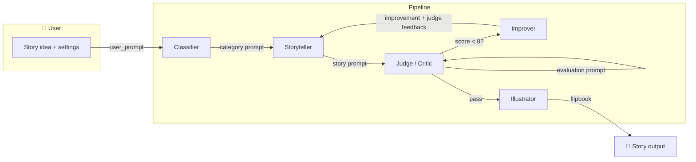
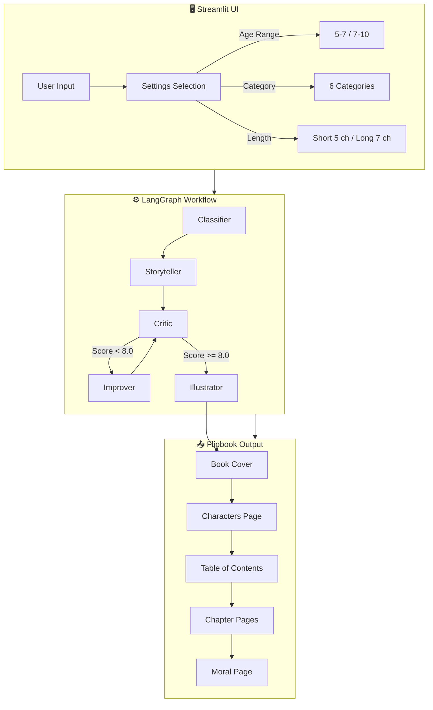

# 🌙 Dreamweaver Bedtime Stories

An intelligent AI-powered bedtime story generator for children ages 5-10. Built with LangChain, LangGraph, and Streamlit, featuring age-adaptive content, chapter-based stories, interactive flipbook reading, and iterative quality assurance.

## ✨ Key Features

### 🎯 Age-Adaptive Content
- **5-7 years**: Simpler sentences, familiar vocabulary, gentle repetition, soothing pacing
- **7-10 years**: Richer vocabulary, slightly more complex plots, still calm and bedtime-appropriate

### 📚 Six Story Categories
| Category | Description |
|----------|-------------|
| 🌙 Bedtime Calm | Peaceful, soothing stories about nighttime and cozy moments |
| 🧭 Light Adventure | Gentle exploration and discovery without danger |
| 😄 Silly & Playful | Lighthearted humor with playful characters |
| ❤️ Friendship | Stories about bonds, kindness, and relationships |
| 🔍 Learning & Curiosity | Educational stories that spark wonder |
| 🎲 Surprise Me | AI chooses the best blend for your idea |

### 📖 Chapter-Based Stories
- **Short**: 5 chapters
- **Long**: 7 chapters

### 📚 Interactive Flipbook Reading Experience
After generating a story, enjoy it in a beautiful book-style interface:
- **Book Cover** with title and category
- **Characters Page** introducing all story characters
- **Table of Contents** with clickable chapter links
- **Chapter Pages** with large readable text and warm colors
- **Moral Page** with the story's lesson
- **Page Navigation** with click and keyboard (arrow keys)

### 📊 Quality Assurance System
Stories are evaluated on 5 criteria (1-10 scale):
1. **Age-Appropriate Language**
2. **Emotional Safety**
3. **Engagement**
4. **Coherence**
5. **Bedtime Suitability**

**Pass Threshold**: Overall ≥ 8.0 AND Safety ≥ 9

## 📋 Assignment Alignment

This implementation addresses the assignment requirements as follows:

| Requirement | Implementation |
|-------------|-----------------|
| **Ages 5–10** | Age bands 5–7 and 7–10 with tailored language and pacing in prompts and critic. |
| **LLM Judge** | **Story Judge (Critic)** evaluates each story on 5 criteria (1–10); pass threshold (overall ≥ 8.0, safety ≥ 9) gates release; below threshold triggers **Improver** with judge feedback, then re-evaluation (loop). |
| **Block diagram** | See *System block diagram* below: User → Classifier → Storyteller → Judge → [Improver loop] → Illustrator; prompts flow through each component. |
| **OpenAI model** | All text agents use **GPT-3.5-Turbo** (unchanged); Gemini used only for image generation. |
| **API key** | Stored in `.env`; `.gitignore` excludes `.env`; key never committed. |
| **“Tell a story”** | Story arcs (5 or 7 chapters), six categories with tailored strategies, classifier routes requests; judge enforces quality and age-appropriacy. |

*User feedback / request changes* is not in the current flow (improvement is judge-driven); listed under *Future scope* below.

## 🏗️ Architecture

### System block diagram (prompts and component flow)

The diagram below shows the flow of **prompts** and interaction between **User**, **Judge (Critic)**, **Storyteller**, and other components:



**Prompt flow in words:** User provides idea and settings → **Classifier** gets a category prompt and assigns a category → **Storyteller** gets a chaptered-story prompt (age, category, length) and generates the draft → **Judge (Critic)** gets an evaluation prompt and scores the story; if below threshold, **Improver** gets judge feedback and an improvement prompt, and the Storyteller is re-invoked with that feedback; when the Judge passes, **Illustrator** gets an image prompt per chapter and the final story is rendered.

### Full workflow (detailed)



### Flipbook Architecture

```
Streamlit App
    ↓
render_flipbook_html(story)  →  utils/flipbook.py
    ↓
Generate self-contained HTML/CSS/JS
    ↓
st.components.v1.html()  →  Embedded iframe
    ↓
Interactive flipbook in browser
```

The flipbook component:
- Generates complete HTML from story JSON
- Uses plain JavaScript for navigation (no external libraries)
- Sanitizes all user content to prevent XSS
- Falls back to tab view if rendering fails

## 🚀 Quick Start

### 1. Clone and Navigate
```bash
cd Agentic_Story_App
```

### 2. Install Dependencies
```bash
pip install -r requirements.txt
```

### 3. Configure API Keys
Create a `.env` file in the project root:
```bash
# Required: OpenAI for story generation and evaluation
OPENAI_API_KEY=your_openai_api_key_here

# Required: Google Gemini for image generation
GEMINI_API_KEY=your_gemini_api_key_here
# OR
GOOGLE_API_KEY=your_google_api_key_here
```

### 4. Run the Application
```bash
streamlit run app.py
```

### 5. Access the App
Open your browser to: http://localhost:8501

## 📁 Project Structure

```
📦 Dreamweaver Bedtime Stories
├── 📄 .env                    # API key configuration
├── 📄 requirements.txt        # Python dependencies
├── 📄 app.py                  # Streamlit UI application
├── 📄 workflow.py             # LangGraph workflow orchestration
├── 📁 agents/                 # AI agent implementations
│   ├── __init__.py
│   ├── classifier.py          # Story category classification
│   ├── storyteller.py         # Chaptered story generation
│   ├── story_critic.py        # Quality evaluation with scoring
│   ├── story_improver.py      # Iterative story improvement
│   ├── gemini_image_generator.py  # Image generation (Gemini)
│   └── generator.py               # Story idea suggestions
├── 📁 models/                 # Pydantic data models
│   ├── __init__.py
│   └── pydantic_models.py     # All data schemas
├── 📁 prompts/                # Prompt templates
│   ├── __init__.py
│   └── prompts.py             # All AI prompt templates
├── 📁 utils/                  # Utility modules
│   ├── __init__.py
│   └── flipbook.py            # Flipbook HTML generator
├── 📁 .streamlit/             # Streamlit configuration
│   └── config.toml            # Theme and settings
└── 📄 README.md               # This file
```

## 📸 Screenshots

### Setup Screen
*Full-width setup: age, category, length, and story idea.*

### Storybook View
*Full-width flipbook reading experience with page navigation.*

*Quality checks run in the background; only the final story is shown.*

## 🎯 How to Use

1. **Setup** (full-width screen)
   - Select age range (5-7 or 7-10 years)
   - Choose story category
   - Pick story length (Short 5 chapters or Long 7 chapters)
   - Enter your story idea, or click "Generate story idea" for suggestions

2. **Create Story**
   - Click "Create My Story"
   - The app switches to full-width storybook mode

3. **Read**
   - Use the flipbook: click or arrow keys to turn pages
   - Click chapter titles in the Table of Contents to jump

4. **Next**
   - Click "Generate Another Story" to return to setup and create a new story

## 🔧 Configuration

### Model Settings
All agents use GPT-3.5-Turbo by default:
- **Classifier**: Low temperature (0.1)
- **Storyteller**: Medium temperature (0.7)
- **Critic**: Low temperature (0.1)
- **Improver**: Medium temperature (0.6)

### Quality Thresholds
In `agents/story_critic.py`:
```python
OVERALL_THRESHOLD = 8.0
SAFETY_THRESHOLD = 9
```

## 🛡️ Safety Features

- **Content Filtering**: All stories evaluated for emotional safety
- **Age-Appropriate Language**: Vocabulary tailored to age range
- **Bedtime Suitability**: Stories wind down to calm endings
- **HTML Sanitization**: User input escaped in flipbook

## 📊 Technical Details

### Dependencies
- `streamlit>=1.28.0` - Web UI framework
- `langchain>=0.1.0` - LLM orchestration
- `langgraph>=0.1.0` - Agent workflow graphs
- `langchain-openai>=0.1.0` - OpenAI integration
- `google-genai>=1.0.0` - Google Gemini SDK (image generation)
- `pydantic>=2.0.0` - Data validation
- `openai>=1.0.0` - OpenAI API client
- `pillow>=10.0.0` - Image processing

### API Usage
- **OpenAI GPT-3.5-Turbo**: Story generation, classification, evaluation (text-based tasks)
- **Google Gemini**: Image generation (illustrations)

## 🔮 Future Scope

If I had more time, I would aim to implement the following:

| # | Feature | Description |
|---|---------|-------------|
| 1 | **React / HTML–CSS UI** | Replace Streamlit with a custom React (or vanilla HTML/CSS/JS) front end for richer layout, theming, and control. |
| 2 | **User feedback** | Let the user rate the story or request changes (e.g. “make it shorter”, “less scary”) and feed that into the Judge or a new “user feedback” improvement step. |
| 3 | **Video element** | Add short video clips or animated segments (e.g. per chapter) to enrich the reading experience. |
| 4 | **Read aloud (TTS)** | Text-to-speech so the story can be read loudly; optional per-chapter or full-story playback with child-friendly voice. |
| 5 | **Translate into another language** | Add a translation step (or prompt) so the same story can be output in another language (e.g. Spanish, Hindi) while keeping age-appropriacy. |
| 6 | **Gender-based classification** | Prompt or classify by gender (e.g. protagonist gender, pronoun preferences) and tailor names/roles in the story. |
| 7 | **Export (PDF / EPUB)** | Allow saving or downloading the story as a PDF or EPUB for reading offline or in e-readers. |
| 8 | **“Put my child in the story”** | Let the user enter a child’s name (and optionally traits) and weave them into the story as the main character. |
| 9 | **Voice input for idea** | Accept spoken story ideas via speech-to-text instead of (or in addition to) typing. |
| 10 | **Accessibility** | Dyslexia-friendly font option, high-contrast mode, and clear focus/keyboard navigation for the flipbook. |
| 11 | **Share & print** | Shareable link or “print-friendly” view so families can print or send the story. |
| 12 | **Illustration style choice** | Let the user pick an illustration style (e.g. watercolor, cartoon, minimal) and pass that into the image prompt. |
| 13 | **Story history / parent dashboard** | Save generated stories per session or account, with favorites and simple search. |

---

*Sweet dreams are made of stories* 🌙✨
